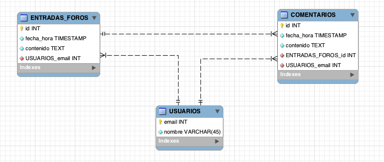

###Escuela Colombiana de Ingeniería
###Procesos de desarrollo de Software - PDSW
####Tecnologías de persistencia - Frameworks de Persistencia - Introducción a MyBatis

####Realizado por
####Hernán Felipe Losada (Chuzz1996)
####Johan Ramirez(JohanRamirezC)

En este laboratorio, se realizará el mismo ejercicio desarrollado semanas atrás con JDBC 'plano', pero esta vez haciendo uso de un 'framework' de persistencia.




##Parte II

Implemente la operación 'load' de MyBATISDaoUsuario. Recuerde que para esto debe:

1. Configurar el 'mapper' para el método _Usuario getUsuario(String email)_ definido en la interfaz UsuarioMapper.
2. Hacer uso del mapper en el DAO correspondiente.

En este caso, a diferencia del ejercicio anterior, el método asociado al 'mapper' tiene parámetros que se deben usar en la sentencia SQL. Es decir, el parámetro 'email' de  _public Usuario getUsuario(String email);_ se debe usar en el WHERE de su correspondiente sentencia SQL. Para hacer esto tenga en cuenta:

1. Agregue la anotación @Param a dicho parámetro, asociando a ésta el nombre con el que se referirá en la sentencia SQL:

	```java
		public Usuario getUsuario(@Param("emailusuario") String email)
	
	```

2. Al XML (\<select>, \<insert>, etc) asociado al método del mapper, agregue la propiedad _parameterType="map"_ .
3. Una vez hecho esto, podrá hacer referencia dentro de la sentencia SQL a este parámetro a través de: #{emailusuario}


## Parte III

Implemente las operaciones:

* save de MyBATISDaoUsuario
* load de MyBATISDaoEntradaForo
* addToForo de MyBATISDaoEntradaForo
